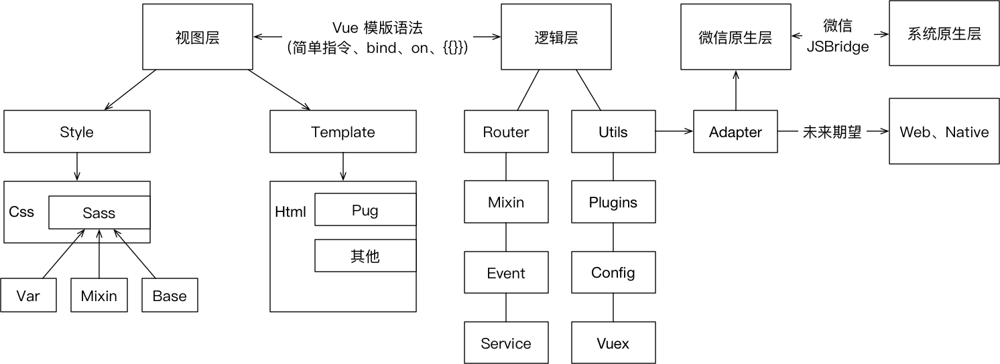

## 框架与组件化如何选型定制

### 框架选型
如何选框架, 其实是一件让人纠结的事, 要考虑很多东西:
- 开发效率
- 配置成本/易用性/拓展性
- 团队技术栈统一/割裂, 带来的学习成本问题
- 多端复用成本
- 性能
- 其他

当时开发小程序的时候, 框架选择基本直接拍定 `mpvue`
- 当时 `mpvue` 如日中天, `taro` 还在懵懂期
- `vue` 简单/易用
  - 从学习成本上来讲, 并不觉得这是个大问题, 毕竟大家都是年轻人, 不会的话 依葫芦画瓢 就完事儿了
  - 从团队技术栈割裂上来讲, 说白了更多是基建支撑不了
- 开发效率问题, 更多是踩坑时间问题
- 考虑到原生层面的繁琐/复杂, 以及考虑到未来多端复用成本, 至少整体迁移到 web 上的话, 成本并不高
- 性能: 先上再说, 过得去就好, 剩下的就慢慢优化 🌚

> 顺便送一张小程序这边的架构图:

### 组件化相关
一说组件化, 其实也很伤, 公司只有 React-Native 的一套移动端组件库。基建支撑不了当时的场景, 所以我又开始了写组件的道路

基于 mpvue 的前提下, 在小程序里写组件, 也会有比较恶心的地方, 由于小程序端代码是静态的(即提前编译好的模版), 所以像 `hoc` 就没办法用了, 我这边用的都是 `mixin`

基础的 `mixin` 有很多:
- 函数调用相关(去抖/节流)
- 列表加载相关
- 用户基础信息/微信信息
- 数据初始化相关
- 分享调用相关
- ......

另外会涉及在小程序端上与 `vue` 的差异性, 比如生命周期, 在 `mpvue` 编译完后, vue 组件生命周期并不会编译成小程序组件的生命周期, 说白了就是你要熟悉两套生命周期: vue 组件生命周期 与 小程序组件生命周期。🙄🙄🙄

#### 逃不过的坎: 原生
`mpvue` 编译完的代码 **运行时的性能** 在很多场景里并不达到你的要求, 比如 **输入组件的双向绑定之光标闪烁/内容回退**, **大数据量之操作延迟** 等等...... （~~听不懂~~没遇到过的同学[自行搜索](https://github.com/Meituan-Dianping/mpvue/issues)）  

当遇到类似上面这种 **高性能要求较高** 的时候, 你就避免不了去寻找解决方案:
- 换框架?
  - 工程浩大?
- 写原生?
  - 复用成本?
- 换工作?
  - 🙂

除了上面这几点需要去衡量的之外, 还要衡量一些非技术因素:
- 产品发展形态/可预见的趋势
- 流量依托
- 用户群
- 其他...

我们这边最终决定: **写原生**, 部分场景集成原生组件  
> 决定因素也是从上面那几点综合考虑, 具体就不细讲了  

由此, 我们的架构慢慢就会变成下面这种样子:  

`vue` 会慢慢成为一个 **数据注入/数据分析/事件分发** 三者集合的中心枢纽 一样的存在, 底层是由各种高性能的原生组件, 上层是由 `vue` 来分发事件给不同组件, 注入数据到不同组件里, 收集埋点行为/事件。

当然也会带来新的问题: 多端复用成本低, 小程序原生学习成本 等  

#### 所以说, 框架/组件选型定制是真的让人操心啊!
