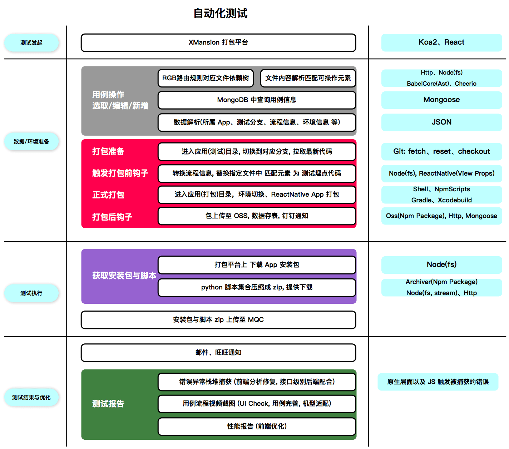

## App 自动化测试探索

> 本文只讨论移动端

说起自动化测试, 对大部分团队来说, 比较痛的点就在于:  

1. 市场上手机种类太尼玛多了, 自家的测试机又太少了, 资金不允许啊
2. 我们没专门的测试人员, 开发 即 测试, 但是搭这套系统又要投人力去探索相关知识, 成本较高

之前探索了自动化相关的东西, 我一开始是拒绝的, 毕竟 我一个大前端工程师 去搞测试的东西, 而且外加背后要 实现的东西有点多 且 复杂程度未知。但是没办法, 头儿下了命令......

下面就说说我的探索到搭建上线的过程, 虽然现在也没人用, 感觉真实浪费了我一大堆时间, 不过也算跑通了

1. 先找了相关云测试平台, 以及一系列对比分析。我找到的比较靠谱的云测试平台就三种: **MQC (阿里)**, **WeTest (腾讯)**, **MTC (百度)**。 为什么找云测平台呢? 因为别人 **机型多** 啊, 不想买机子, 只能用他们的了, 这种就是看你们公司如何看待 **长远利益** 了。后来经过一番对比, 最终选择了 **MQC**。下面直接上图:  

2. 既然要对接到 MQC, 那就要搞个服务了, 要不 `jenkins`? 想想拓展插件要写 Java, 我内心又是拒绝。思来想去, MQC 不是 `java` 和 `python` 都可以啊, 要不试试 python 怎么跑的, 然后尝试探索了一波, 发现 MQC 的原理其实就是在 `Appium`(下面会介绍到) 上, 包装了一些东西(比如底层 adb logcat 的日志信息捕获分析, 以及相关 python 封装的 Appium 的接口调用 等)。既然如此, 那我不如改造一下 MQC 自带的 python, 然后加一些错误捕获机制和定制的操作, 我马上就行动起来, 也就导致了最终解决方案: 把一套指定流程操作的 AST 转换成 python, 然后打包成 zip, 大功告成!

说的容易, 做的难, 期间遇到了一大堆麻烦:

1. 测试首先需要元素 (而我们的项目都是 ReactNative), 如何定位元素?
    - xpath, 缺陷: UIAutomation 绘制的 xpath 在不同机型上**不同** (当初被这个地方坑死)
    - resource_id, 原生层面的元素标记值, 而我们是 ReactNative 项目
    - accessibility_id, ReactNative 支持该 props 透出到原生层面 (目前采取的就是常用交互元素封装这个属性值)
    - tag_name
    - class_name
    - ......

2. 工程目录文件树内的路由分析 与 线上页面统计名 对应匹配
    - 扫描路由文件, 通过 babel-core 转换成 AST, 再获取 import 进来的文件 (要注意的是如今有好几种模块暴露写法: ES6, CommonJs), 最终形成一颗 路由树
    - 递归 路由树 与 线上页面统计名 匹配

3. Python 脚本改造
    - 操作错误捕获能力 改造
    - 查找元素方式改造
    - 大部分交互操作方法基本都重写了
    - 自定义日志形式
    - 集成一套自定义操作的数据结构与解析

4. Appium 的探索与实践 (非常重要!!!)
5. 安卓 与 adb 相关知识

### 最终成果

顺手留张图:

虽然暂时没啥人用, 但是至少掌握这一套基础能力, 而且只要有足够的测试机, 我可以自己搭一个 MQC, 不过我的想法就是公司有 **足够** 的测试机, 那测试脚本就可以自动跑空闲的测试机 (毕竟产品还是先服务内部), 感觉特么这是要转型成测试工程师的节奏......

至于未来对现有产品的优化:
- 无非是统一管理好我们的 **少量宝贵** 的测试机, 然后提供一个服务, 通过线上化平台 **远程连接** 测试机自主测试
- 另外就是提供投影用于 **录制** 相关脚本

路漫漫其修远兮, 想想这个产品做大了之后可以这么吊, 还是很激动啊, 可惜这事暂时推不动, 上头也不是很在意, 估计规模再翻几番, 才会考虑这个东西吧, 可惜了我这个大前端工程师...
