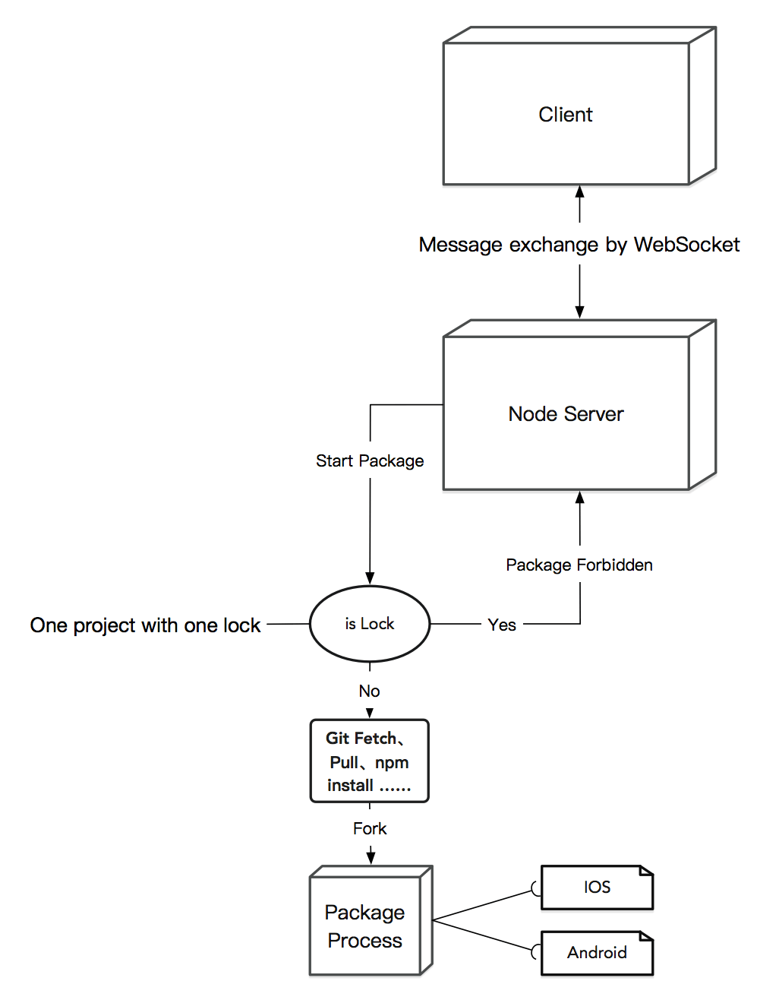

## React Native 项目打包

之前曾参与了打包平台的建设, 迄今为止, 技术方式较简单

### 现在的打包平台

> 部分技术细节忽略  

直接上图  

现在比较简单, 就是一个项目打包的时候会锁住项目, 只有打完包才会开锁, 然后就是拉仓库代码, 切分支, 安装三方包, 跑编译签名...另外每次打全量包, 打包时间较长(一般 4分半 左右)

### 未来

上周和一个大佬聊到这个项目, 就有很多新的思考  

#### 先说现在打包平台存在的问题:  
- 设计架构上还不够理想, 代码方面也比较杂乱无章
- 进程锁, 单项目唯一进程打包
- 无论是否含有原生代码, 都打全量包, 浪费大量打包时间

#### 未来与思考:

- 利用 **Docker** 来 **隔离资源环境**, 增加**打包线程**, 达到 一个机子 媲美 多个机子 的功效, 架构上就是 **Master** <-> **Worker** 的架构设计, 但不确定的就是 Docker 是否有 `Xcode` 和 `Android Stdiuo` 的环境的镜像（这个想法很早就有了, 只是在 `时间和收益的性价比` 上感觉不划算, 因为我们现在的打包平台已经足够支撑了, 所以只能坐冷板凳了）
- **非原生更新** 就只打 **JS 包** 套接上 **原生包的壳**, 这是上周一个大佬给我的启发, 为什么每次都打 **全量** 包, 只打 **JS** 包不就好了, 又快又稳, 反正只改了 JS。然后想想确实该这样, 因为热更新的原理就是这样: 解压 `ipa/apk`, 下载 `JS 包`, 替换一下就好了(中间你可以加个 `diff` 啥的, 提升速度和稳定性)。当然这种设计的原理就是上一次发布的原生版本就是 `上帝`, 以后每次都从 `上帝` 这边替换老的 `JS 以及其他资源块`(RN 打包资源的时候, 会顺便打包 `本地` 图片以及 `node_modules` 里三方包的图片资源), 至于实际打包增速, 我根据我本地的一个项目算了下: 只打 JS 包 **37s**(基本这个数上下 10s 内), 打全量包 **3分半 - 5分半之间**, 至少缩减了 **5倍** 以上的时间
