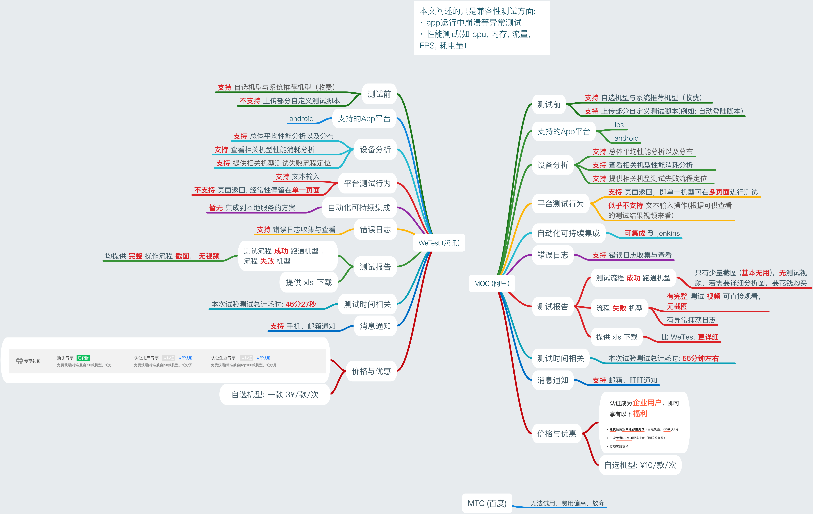

## 自动化测试探索

> 本文只讨论移动端

说起自动化测试, 对大部分团队来说, 比较痛的点就在于:  

1. 市场上手机种类太尼玛多了, 自家的测试机又太少了, 资金不允许啊
2. 我们没专门的测试人员, 开发 即 测试, 但是搭这套系统又要投人力去探索相关知识, 成本较高

之前探索了自动化相关的东西, 我一开始是拒绝的, 毕竟 我一个大前端工程师 去搞测试的东西, 而且外加背后要 实现的东西有点多 且 复杂程度未知。但是没办法, 头儿下了命令......

下面就说说我的探索到搭建上线的过程, 虽然现在也没人用, 感觉真实浪费了我一大堆时间, 不过也算跑通了

1. 先找了相关云测试平台, 以及一系列对比分析。我找到的比较靠谱的云测试平台就三种: **MQC (阿里)**, **WeTest (腾讯)**, **MTC (百度)**。 为什么找云测平台呢? 因为别人 **机型多** 啊, 不想买机子, 只能用他们的了, 这种就是看你们公司如何看待 **长远利益** 了。后来经过一番对比, 最终选择了 **MQC**。下面直接上图:  

2. 既然要对接到 MQC, 那就要搞个服务了, 要不 `jenkins`? 想想拓展插件要写 Java, 我内心又是拒绝。思来想去, MQC 不是 `java` 和 `python` 都可以啊, 要不试试 python 怎么跑的, 然后尝试探索了一波, 发现 MQC 的原理其实就是在 `Appium`(下面会介绍到) 上, 包装了一些东西(比如底层 Android logcat 的日志信息捕获分析, 以及相关 python 封装的 Appium 的接口调用 等)。既然如此, 那我不如改造一下 MQC 自带的 python, 然后加一些错误捕获机制和定制的操作, 我马上就行动起来, 也就导致了最终解决方案: 把一套指定流程操作的 AST 转换成 python, 然后打包成 zip, 大功告成!

说的容易, 做的难, 期间遇到了一大堆麻烦:

- 未完待续

